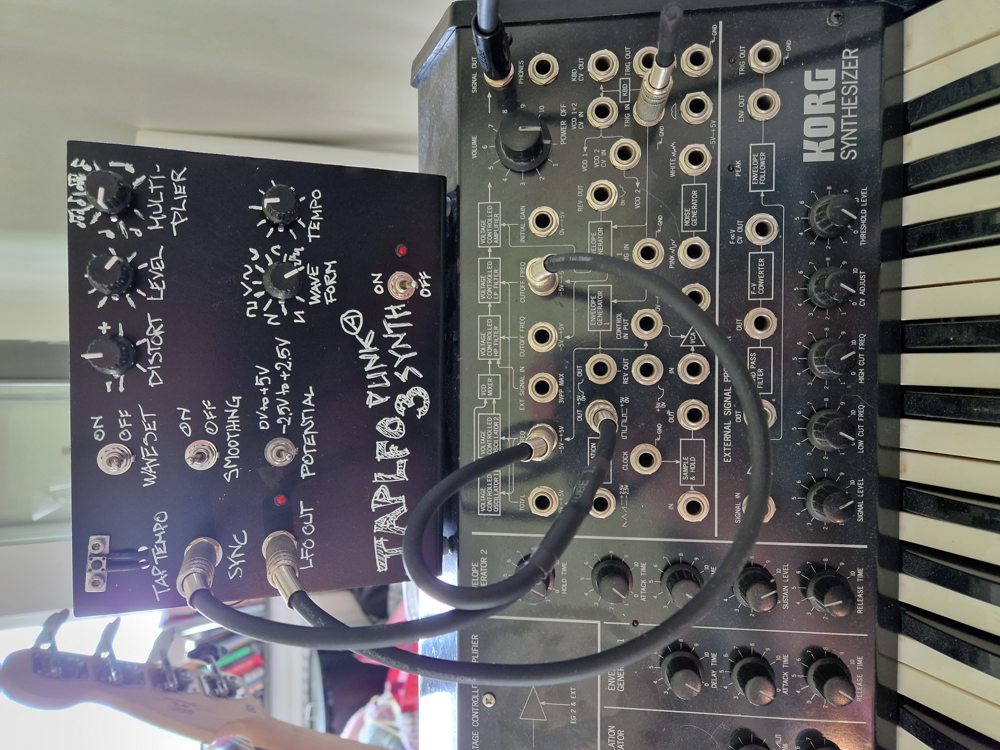

# TAP LFO
TAP LFO is a low-frequency oscillator based on the ic-circuit TAPLFO3 rev C/D from Electric Druid

## Introduction
The ic-circuit is from [Electric Druid](https://electricdruid.net/product/taplfo3/) and cost as low as €4.45.

The function of this LFO is, and I am quoting:

"The TAPLFO chip adds a powerful feature to your LFOs: you can set the LFO frequency by tapping a tempo on a button connected to the chip, or by changing the Tempo CV. With this chip you can build tap tempo effects units or stompboxes, tap tempo controlled drum machines or tap tempo sequencer clocks.
The LFO can produce 8 waveforms, including a random (sample & hold) wave. All the waveforms except the random wave can be altered by the wave distortion CV."

What I have done is a PoP (proof of principle) where I have set up the circuit on a perfboard with a complementing aluminium panel with knob, switches and potentiometers.

## How to use the circuit
To test the TAPLFO3, I have hooked it up to a Korg MS-20 to use it as a 2nd LFO (or Modulation Generator in MS-20 language). The TAPLFO can then be syncronized via the Modulation Generator of the MS-20

## Schematics
The schematic and the BOM-list is provided as pdf-documents.

## Usage
I have provided some pics of the perfboard and the panel connected the the Korg MS-20.

## Contributing
Pull requests are welcome. For major changes, please open an issue first
to discuss what you would like to change.

## License
[GPLv3](https://www.gnu.org/licenses/gpl-3.0.en.html)
